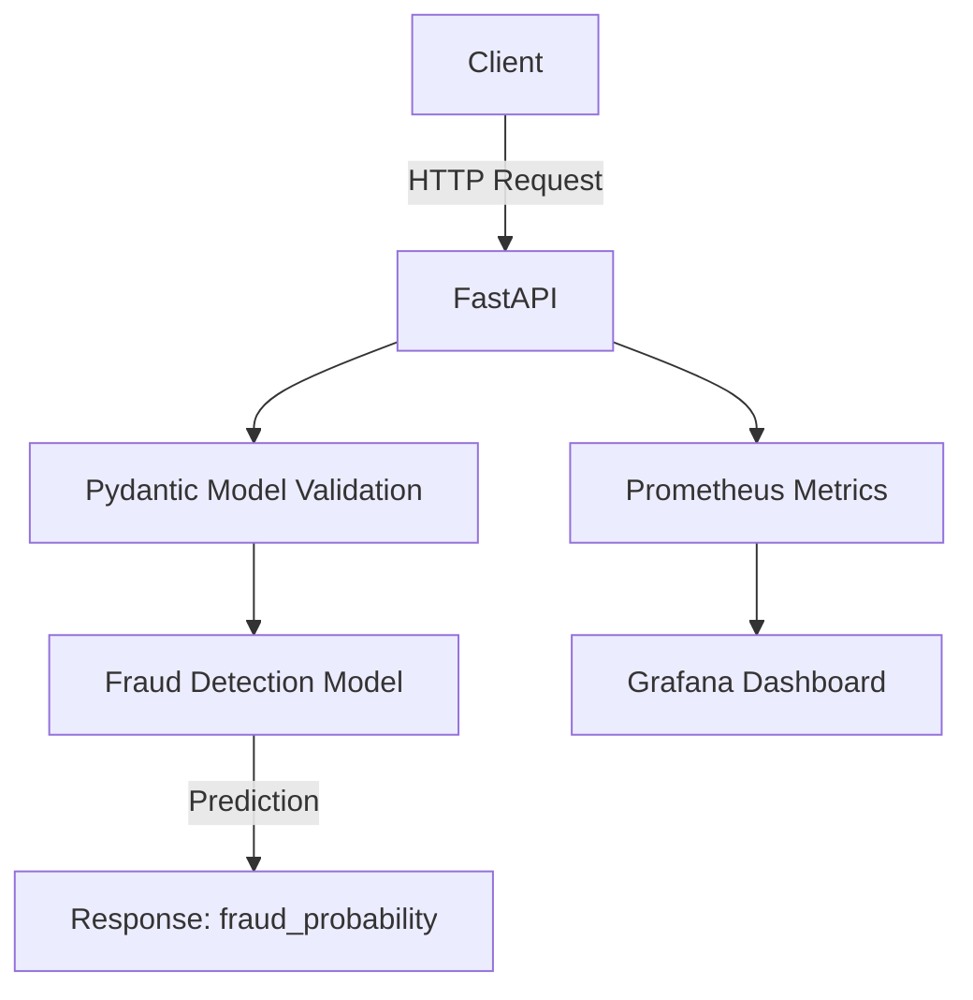

# Fraud Detection API

A machine-learning-powered REST API that scores credit card transactions for fraud in real time, packaged and deployed the way a production service would be: containerized, orchestrated on Kubernetes with autoscaling, instrumented with Prometheus, and load-tested with Locust.

> Trained on the [Kaggle Credit Card Fraud Detection dataset](https://www.kaggle.com/mlg-ulb/creditcardfraud) (284,807 transactions, 492 fraudulent).

<!-- Update this badge with your actual GitHub username/repo once pushed -->


## What this project demonstrates

Most "fraud detection" portfolio projects stop at a notebook and a confusion matrix. This one goes further: the trained model is served behind a validated FastAPI endpoint, containerized with Docker, deployed to Kubernetes with a Horizontal Pod Autoscaler, monitored with Prometheus, and covered by both unit tests (pytest) and load tests (Locust), with CI running the test suite on every push.

## Architecture



| Layer | Technology | Purpose |
|---|---|---|
| API server | FastAPI + Uvicorn | Handles HTTP requests, validates input, returns predictions |
| ML model | scikit-learn (`RandomForestClassifier`) | Pre-trained fraud classifier (`models/fraud_model.pkl`) |
| Validation | Pydantic | Enforces the expected input schema (V1-V28, Amount) |
| Containerization | Docker | Packages the API and its dependencies |
| Orchestration | Kubernetes (Minikube) | Deployment, autoscaling (HPA), service discovery |
| Monitoring | Prometheus + Grafana | Request latency, error rates, prediction counts |
| Load testing | Locust | Simulates concurrent traffic |
| Testing | Pytest | Endpoint and input-validation coverage |
| CI | GitHub Actions | Runs the test suite and a Docker build on every push/PR |

## API

| Endpoint | Method | Description |
|---|---|---|
| `/` | GET | API status |
| `/health` | GET | Health check (used by k8s liveness/readiness probes) |
| `/model_info` | GET | Model type, feature names, class labels |
| `/predict` | POST | Fraud probability for a transaction |

`/predict` expects the 29 features the model was trained on (`V1`-`V28`, `Amount` -- PCA-transformed features from the source dataset, `Time` is not used):

```json
{
  "V1": -1.3598, "V2": -0.0728, "V3": 2.5363, "V4": 1.3782,
  "V5": -0.3383, "V6": 0.4624, "V7": 0.2398, "V8": 0.0987,
  "V9": 0.3264, "V10": 0.1894, "V11": -0.2256, "V12": -0.6384,
  "V13": 0.1012, "V14": -0.3398, "V15": 0.1671, "V16": 0.1258,
  "V17": -0.0064, "V18": 0.0883, "V19": -0.0574, "V20": -0.0693,
  "V21": -0.2256, "V22": 0.0626, "V23": 0.0617, "V24": 0.0094,
  "V25": -0.0314, "V26": -0.0688, "V27": 0.0349, "V28": 0.0274,
  "Amount": 149.62
}
```

Response:

```json
{
  "prediction": 0,
  "fraud_probability": 0.02,
  "is_fraud": false,
  "model_version": "1.0",
  "threshold": 0.5,
  "status": "success"
}
```

## Model performance

RandomForest (`n_estimators=100`, `max_depth=10`, `class_weight="balanced"`), stratified 80/20 train/test split:

| Metric | Score |
|---|---|
| Accuracy | 0.999 |
| Precision | 0.806 |
| Recall | 0.806 |
| F1 | 0.806 |
| Matthews Correlation Coefficient | 0.806 |

Accuracy alone is not meaningful here given the ~0.17% fraud rate in the dataset -- precision/recall/MCC are the numbers that matter. Recall of ~0.81 means roughly 1 in 5 fraudulent transactions is currently missed at the default 0.5 classification threshold; tuning that threshold against the cost of false negatives vs. false positives is the next lever for improving this (see Roadmap).

## Quickstart

### Local

```bash
pip install -r requirements-dev.txt   # includes pytest, notebook tooling, locust
uvicorn app.main:app --reload
# http://localhost:8000/docs for interactive Swagger UI
```

```bash
pytest tests/ -v
```

### Docker

```bash
docker build -t fraud-detection-api:latest .
docker-compose up --build
# API at http://localhost:8000
```

### Kubernetes (Minikube)

```bash
minikube start --driver=docker
minikube docker-env | Out-String | Invoke-Expression   # PowerShell; use `eval $(minikube docker-env)` on bash
docker build -t fraud-detection-api:latest .
kubectl apply -f k8s/
minikube service fraud-detection-service
```

### Load testing

```bash
locust -f tests/locustfile.py
# http://localhost:8089
```

## Project structure

```
Credit-card_Fraud-Detection/
├── app/
│   ├── main.py               # FastAPI app: endpoints, model loading
│   └── schema.py             # Pydantic input schema (single source of truth)
├── k8s/                       # Deployment, Service, HPA manifests
├── models/
│   ├── fraud_model.pkl        # Trained scikit-learn model
│   └── credit-card-fraud-analysis.ipynb  # Training/EDA notebook
├── tests/
│   ├── test_api.py            # pytest suite
│   └── locustfile.py          # Locust load test
├── .github/workflows/ci.yml   # CI: tests + Docker build
├── Dockerfile
├── docker-compose.yaml
├── requirements.txt           # Runtime/API dependencies only
├── requirements-dev.txt       # + notebook, test, and load-test tooling
└── fraud-detection-api-project-documentation.md  # Extended technical documentation
```

## Roadmap

- **Auth**: no authentication currently guards `/predict` -- highest-priority gap before any real deployment.
- **Threshold tuning**: move off the fixed 0.5 cutoff toward a threshold chosen from the precision/recall tradeoff.
- **Model iteration**: cross-validation, XGBoost/LightGBM comparison, calibrated probabilities.
- **Ops**: multi-stage Docker build, structured logging, cloud Kubernetes (EKS/GKE/AKS), model metadata persisted alongside `fraud_model.pkl` instead of hardcoded in `/model_info`.

See `fraud-detection-api-project-documentation.md` for the full, longer-form roadmap and architecture notes.

## Author

Harshal Paresh Trivedi

## License

MIT
