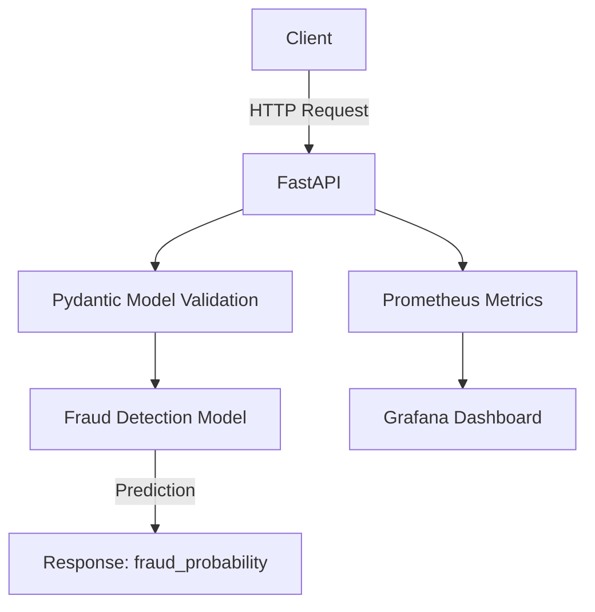

# 🚀 Fraud Detection API Project Documentation

---

## **Project Overview**

### **Purpose**
The **Fraud Detection API** is a **machine learning-powered REST API** designed to predict credit card fraud in real-time. It leverages a pre-trained model (trained on the [Kaggle Credit Card Fraud Detection Dataset](https://www.kaggle.com/mlg-ulb/creditcardfraud)) to classify transactions as **fraudulent** or **legitimate** based on input features.

### **🔹 Key Features**
- **Real-time predictions** via a `/predict` endpoint.
- **High availability** with Kubernetes (Minikube for local development).
- **Input validation** using Pydantic models.
- **Monitoring** with Prometheus and Grafana.
- **Load testing** with Locust.
- **Unit testing** with `pytest`.

---

---

## **Architecture**



### **Components**
| **Component**       | **Technology**          | **Purpose**                                                                                     |
|--------------------|-------------------------|-------------------------------------------------------------------------------------------------|
| **API Server**     | FastAPI + Uvicorn       | Handles HTTP requests, validates input, and returns predictions.                            |
| **ML Model**       | Scikit-learn            | Pre-trained model (`fraud_model.pkl`) for fraud classification.                                 |
| **Validation**     | Pydantic                | Ensures input data matches the expected schema (V1-V28, Amount, Time).                        |
| **Containerization**| Docker                 | Packages the API and dependencies into a portable container.                                 |
| **Orchestration**  | Kubernetes (Minikube)   | Manages deployment, scaling, and service discovery locally.                                   |
| **Monitoring**     | Prometheus + Grafana    | Tracks API performance, errors, and resource usage.                                           |
| **Load Testing**   | Locust                 | Simulates high traffic to test scalability.                                                    |
| **Testing**        | Pytest                 | Validates API endpoints and logic.                                                             |

---

---

## **Project Structure**

```
Credit-card_Fraud-Detection/
├── app/
│   ├── __init__.py          # Empty (Python package)
│   ├── main.py              # FastAPI app (endpoints, model loading)
│   └── schema.py            # Pydantic models (input validation)
├── k8s/
│   ├── deployment.yaml      # Kubernetes deployment config
│   ├── service.yaml         # Kubernetes service config
│   └── hpa.yaml             # Horizontal Pod Autoscaler
├── models/
│   ├── fraud_model.pkl                    # Pre-trained Scikit-learn model
│   └── credit-card-fraud-analysis.ipynb   # Training / EDA notebook
├── data/
│   └── creditcard.csv       # Kaggle dataset (gitignored -- not committed)
├── tests/
│   ├── test_api.py          # Unit tests (pytest)
│   └── locustfile.py        # Load testing (Locust)
├── .github/workflows/ci.yml # CI: pytest + Docker build on push/PR
├── Dockerfile                # Docker image configuration
├── docker-compose.yaml       # Local development with Docker Compose
├── requirements.txt          # Runtime/API dependencies only
├── requirements-dev.txt      # + notebook, pytest, locust
└── README.md                 # Project setup and usage
```

---

---

## **Current Implementation**

### **API Endpoints**
| **Endpoint**       | **Method** | **Description**                                                                 | **Request Body**                          | **Response**                          |
|--------------------|------------|---------------------------------------------------------------------------------|------------------------------------------|---------------------------------------|
| `/`                | GET        | Root endpoint (API status)                                                    | None                                     | `{"message": "Fraud Detection API is running!"}` |
| `/health`          | GET        | Health check (for Kubernetes liveness/readiness probes)                       | None                                     | `{"status": "healthy"}`               |
| `/predict`         | POST       | Predict fraud probability for a transaction                                    | `{"V1": float, "V2": float, ..., "Amount": float}` | `{"fraud_probability": float}`      |

### **Input Schema (Pydantic Model)**
The `/predict` endpoint expects **29 fields**, matching exactly the features the model was trained on (`Time` and `Class` are dropped before training -- see the training notebook -- so `Time` is intentionally not part of the request schema):
- **`V1-V28`**: PCA-transformed features (scaled for privacy).
- **`Amount`**: Transaction amount (positive float).

**Example Input:**
```json
{
  "V1": -1.3598,
  "V2": -0.0728,
  "V3": 2.5363,
  "V4": 1.3782,
  "V5": -0.3383,
  "V6": 0.4624,
  "V7": 0.2398,
  "V8": 0.0987,
  "V9": 0.3264,
  "V10": 0.1894,
  "V11": -0.2256,
  "V12": -0.6384,
  "V13": 0.1012,
  "V14": -0.3398,
  "V15": 0.1671,
  "V16": 0.1258,
  "V17": -0.0064,
  "V18": 0.0883,
  "V19": -0.0574,
  "V20": -0.0693,
  "V21": -0.2256,
  "V22": 0.0626,
  "V23": 0.0617,
  "V24": 0.0094,
  "V25": -0.0314,
  "V26": -0.0688,
  "V27": 0.0349,
  "V28": 0.0274,
  "Amount": 149.62
}
```

### **Model Details**
- **Framework**: Scikit-learn (`RandomForestClassifier` or similar).
- **Output**: `fraud_probability` (float between 0 and 1).
- **File**: `models/fraud_model.pkl` (loaded at startup).

### **Key Files**

#### **1. `app/main.py`**
- **Purpose**: FastAPI app with endpoints, model loading, and logging.
- **Key Features**:
  - Imports `Transaction` from `schema.py` (no duplication).
  - Loads model from `models/fraud_model.pkl`.
  - Includes `/`, `/health`, and `/predict` endpoints.
  - Logs requests and predictions.

#### **2. `app/schema.py`**
- **Purpose**: Pydantic model for input validation.
- **Key Features**:
  - Defines `Transaction` class with fields `V1-V28` and `Amount`.
  - Uses `Field` for validation (e.g., `gt=-10`, `lt=10`).

#### **3. `requirements.txt` / `requirements-dev.txt`**
Runtime dependencies (`requirements.txt`) are kept separate from notebook/test tooling (`requirements-dev.txt`), so the Docker image only installs what the API actually needs:
```text
# requirements.txt (runtime)
fastapi==0.109.0
uvicorn==0.27.0
pandas==2.1.4
numpy==1.24.3
scikit-learn==1.4.0
joblib==1.3.2
python-multipart==0.0.6
pydantic==2.5.3
prometheus-fastapi-instrumentator==5.9.1
```
```text
# requirements-dev.txt (adds, on top of requirements.txt)
matplotlib==3.8.0
seaborn==0.12.2
jupyter==1.0.0
pytest==7.4.4
httpx==0.26.0
locust==2.24.0
```

#### **4. `tests/test_api.py`**
- **Purpose**: Unit tests for API endpoints.
- **Tests**: root, health, model_info, a valid `/predict` call, and several invalid-input cases (missing field, out-of-range value, negative `Amount`, wrong type) that assert a `422`.

#### **5. `locustfile.py`**
- **Purpose**: Load testing with Locust.
- **Simulates**: Multiple users sending `/predict` requests.

---

---

## **Current Status**

### **What’s Working**
- **Local Development**: API runs with `uvicorn app.main:app --reload`.
- **Docker**: Containerized with `Dockerfile` and `docker-compose.yaml`.
- **Kubernetes**: Deployed to Minikube with `deployment.yaml`, `service.yaml`, and `hpa.yaml`.
- **Testing**: Unit tests (`pytest`) and load tests (`locust`) pass.
- **Monitoring**: Prometheus metrics exposed at `/metrics`.

### **⚠️ Known Issues (Resolved)**
| **Issue**                          | **Solution**                                                                                     |
|-----------------------------------|-------------------------------------------------------------------------------------------------|
| Missing `/` and `/health` endpoints | Added to `main.py`.                                                                             |
| Model path incorrect in Docker     | Fixed to `models/fraud_model.pkl` (relative to `app/`).                                        |
| Pydantic model duplication        | Moved to `schema.py` and imported in `main.py`.                                                  |
| Missing `joblib` dependency        | Added to `requirements.txt`.                                                                     |
| JSON serialization error           | Converted `fraud_probability` to `float` in `/predict` endpoint.                              |

---

---

## **Future Plans**

### **Short-Term (Next 1-2 Weeks)**
| **Task**                          | **Goal**                                                                                     | **Tools/Tech**               |
|----------------------------------|---------------------------------------------------------------------------------------------|------------------------------|
| **Add Authentication**          | Secure endpoints with API keys or JWT.                                                     | FastAPI OAuth2, Firebase Auth |
| **Add Database**                 | Store predictions for auditing.                                                             | PostgreSQL, SQLAlchemy        |
| **Improve Logging**              | Add structured logs (JSON) and log to a file.                                                | Python `logging`, ELK Stack   |
| **Add Caching**                  | Cache frequent predictions to reduce latency.                                               | Redis, FastAPI Cache          |
| **Optimize Docker Image**       | Reduce image size with multi-stage builds.                                                  | Docker, Alpine Linux          |
| **Add CI/CD Pipeline**          | Automate testing and deployment.                                                             | GitHub Actions, Docker Hub    |

### **Mid-Term (Next 1-2 Months)**
| **Task**                          | **Goal**                                                                                     | **Tools/Tech**               |
|----------------------------------|---------------------------------------------------------------------------------------------|------------------------------|
| **Deploy to Cloud**              | Migrate from Minikube to a cloud Kubernetes cluster (EKS/GKE/AKS).                         | Terraform, Helm              |
| **Add Frontend Dashboard**       | Visualize predictions and metrics.                                                          | React, Plotly Dash            |
| **Retrain Model**                | Improve accuracy with new data.                                                              | Scikit-learn, TensorFlow     |
| **Add Alerts**                   | Notify on high fraud probability (e.g., Slack/PagerDuty).                                    | Prometheus Alertmanager      |
| **Optimize Model**              | Reduce latency and improve performance.                                                      | ONNX, TensorRT              |

### **Long-Term (Next 3-6 Months)**
| **Task**                          | **Goal**                                                                                     | **Tools/Tech**               |
|----------------------------------|---------------------------------------------------------------------------------------------|------------------------------|
| **Add Feature Store**            | Store and reuse features for ML models.                                                     | Feast, Tecton                |
| **Implement A/B Testing**       | Test new models against the current one.                                                    | MLflow, Kubeflow             |
| **Add Multi-Region Deployment** | Deploy to multiple regions for global low-latency access.                                   | AWS/GCP Multi-Region         |
| **Add Explainability**           | Explain predictions (e.g., SHAP values).                                                    | SHAP, LIME                  |
| **Monetization**                 | Offer API as a service (e.g., via Stripe).                                                    | Stripe, FastAPI              |

---

---

## **Setup Instructions**

### **🔹 Prerequisites**
| **Tool**               | **Version**       | **Installation Command**                                                                                     |
|------------------------|-------------------|-------------------------------------------------------------------------------------------------------------|
| Python                 | 3.11+             | [Download Python](https://www.python.org/downloads/)                                                        |
| Docker                 | Latest            | [Install Docker Desktop](https://www.docker.com/products/docker-desktop/)                                |
| Minikube               | Latest            | `choco install minikube` (Windows) or `brew install minikube` (Mac)                                           |
| kubectl                | Latest            | `choco install kubernetes-cli` (Windows) or `brew install kubectl` (Mac)                                      |
| Helm                   | Latest            | `choco install kubernetes-helm` (Windows) or `brew install helm` (Mac)                                         |
| Git                    | Latest            | [Install Git](https://git-scm.com/downloads)                                                                |

### **Local Development**
1. **Clone the repository**:
   ```bash
   git clone <your-repo-url>
   cd Credit-card_Fraud-Detection
   ```

2. **Install dependencies** (use `requirements-dev.txt` locally to also get pytest/locust/notebook tooling; the Docker image installs the leaner `requirements.txt`):
   ```bash
   pip install -r requirements-dev.txt
   ```

3. **Run the API locally**:
   ```bash
   uvicorn app.main:app --reload
   ```
   - Open `http://localhost:8000/docs` for Swagger UI.

4. **Test the API**:
   ```bash
   pytest tests/ -v
   ```

### **Docker Deployment**
1. **Build the Docker image**:
   ```bash
   docker build -t fraud-detection-api:latest .
   ```

2. **Run with Docker Compose**:
   ```bash
   docker-compose up --build
   ```
   - API will be available at `http://localhost:8000`.

### **Kubernetes Deployment (Minikube)**
1. **Start Minikube**:
   ```bash
   minikube start --driver=docker
   ```

2. **Enable Minikube’s Docker daemon**:
   ```bash
   minikube docker-env | Out-String | Invoke-Expression
   ```

3. **Build the Docker image**:
   ```bash
   docker build -t fraud-detection-api:latest .
   ```

4. **Deploy to Minikube**:
   ```bash
   kubectl apply -f k8s/
   ```

5. **Access the API**:
   ```bash
   minikube service fraud-detection-service
   ```

6. **Port-forward for local testing**:
   ```bash
   kubectl port-forward svc/fraud-detection-service 8000:80
   ```
   - API will be available at `http://localhost:8000`.

### **Load Testing**
1. **Install Locust** (included in `requirements-dev.txt`):
   ```bash
   pip install locust
   ```

2. **Run load tests**:
   ```bash
   locust -f tests/locustfile.py
   ```
   - Open `http://localhost:8089` to start the test.

---

---

## **Monitoring and Debugging**

### **🔹 Prometheus + Grafana**
1. **Install Prometheus and Grafana**:
   ```bash
   helm repo add prometheus-community https://prometheus-community.github.io/helm-charts
   helm install prometheus prometheus-community/kube-prometheus-stack
   ```

2. **Access Grafana**:
   ```bash
   kubectl port-forward svc/prometheus-grafana 3000:80
   ```
   - Open `http://localhost:3000` (user: `admin`, pass: `prom-operator`).

3. **View Metrics**:
   - Import a FastAPI dashboard or create custom dashboards for:
     - Request latency.
     - Error rates.
     - Prediction counts.

### **Logs**
- **View pod logs**:
  ```bash
  kubectl logs -l app=fraud-detection-api --tail=50
  ```
- **Stream logs**:
  ```bash
  kubectl logs -l app=fraud-detection-api -f
  ```

---

---

## **How You Can Help**

If you’re reviewing this project, here’s how you can contribute:

### **For Developers**
- **Improve the model**: Train a better fraud detection model (e.g., XGBoost, Neural Networks).
- **Add features**: Implement authentication, caching, or database integration.
- **Optimize performance**: Reduce latency or improve throughput.
- **Write tests**: Add more unit tests or integration tests.

### **For Testers**
- **Test edge cases**: Try invalid inputs, high load, or missing fields.
- **Report bugs**: Open issues for any unexpected behavior.
- **Suggest improvements**: Share ideas for new features or enhancements.

### **For DevOps**
- **Improve deployment**: Automate CI/CD or add monitoring.
- **Optimize infrastructure**: Reduce costs or improve scalability.
- **Security review**: Audit the API for vulnerabilities.

---

---

## **Contact & Support**

- **Author**: Harshal Paresh Trivedi
- **Email**: harshal1901@gmail.com

---

---

## **License**

This project is licensed under the **MIT License**.

---

*Last Updated: August 18, 2026*